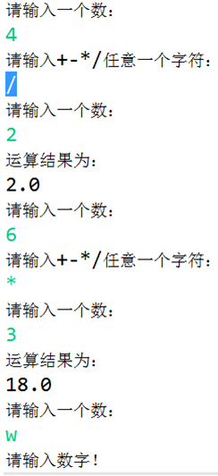
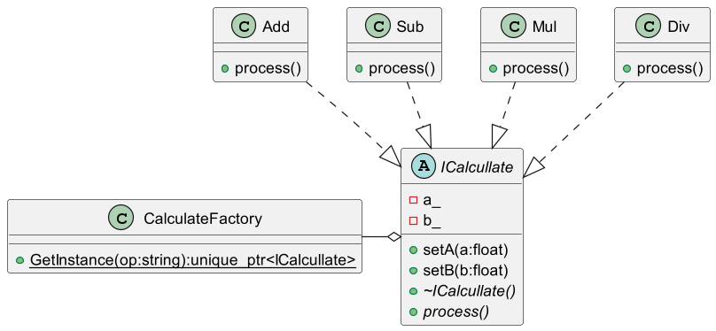
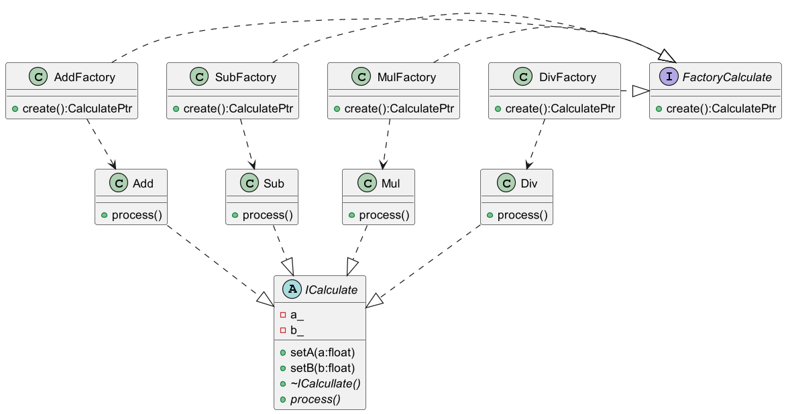
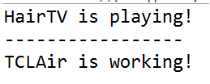
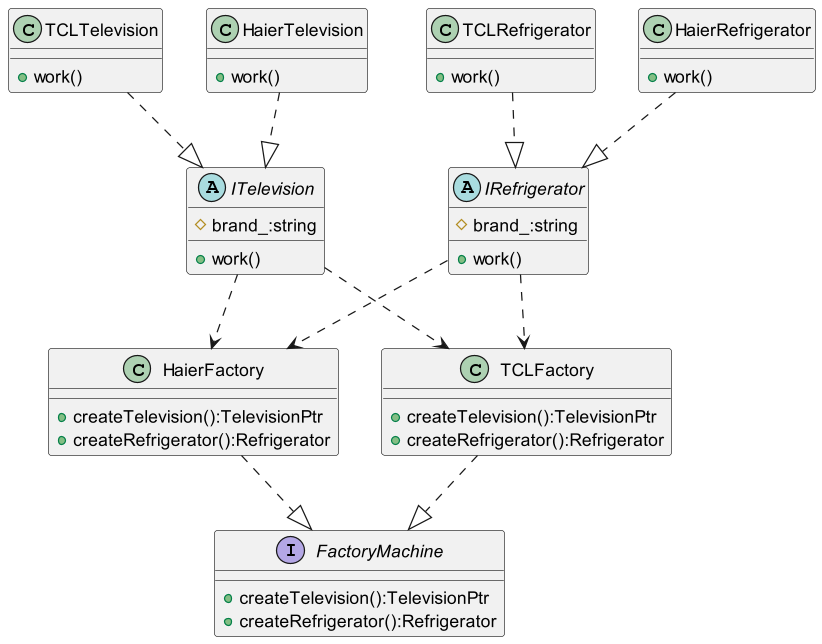
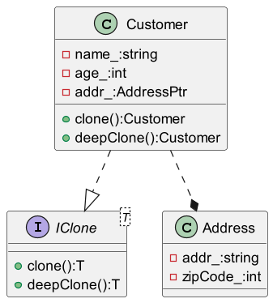
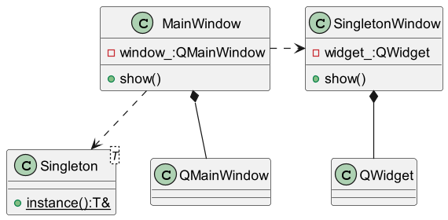

<!-- TOC -->
* [创建型模式](#创建型模式)
  * [1. 简单工厂模式](#1-简单工厂模式)
    * [题目](#题目)
    * [具体实现](#具体实现)
    * [总结](#总结)
  * [2. 工厂方法模式](#2-工厂方法模式)
    * [题目](#题目-1)
    * [具体实现](#具体实现-1)
    * [总结](#总结-1)
  * [3. 抽象工厂模式](#3-抽象工厂模式)
    * [题目](#题目-2)
    * [具体实现](#具体实现-2)
    * [总结](#总结-2)
  * [4. 原型模式](#4-原型模式)
    * [题目](#题目-3)
    * [具体实现](#具体实现-3)
    * [总结](#总结-3)
  * [5.单例模式](#5单例模式)
    * [题目](#题目-4)
    * [具体实现](#具体实现-4)
    * [总结](#总结-4)
<!-- TOC -->
# 创建型模式
只包含了部创建型模式.
## 1. 简单工厂模式
### 题目
通过仔细试运用面向使用简单工厂模式设计能够实现包含加法（+）、减法（-）、乘法（*）、除法（/）四种运算的计算机程序，要求输入两个数和运算符，得到运算结果。要求使用相关的工具绘制UML类图并严格按照类图的设计编写程序实现。

参考运行结果:

### 具体实现
类图关系如下:

具体的代码实现牵扯到如下文件:
* [calculate.h](calculate.h)
* [calculate_factory_v1.h](calculate_factory_v1.h)
* [calculate_factory_v1.cc](calculate_factory_v1.cc)

功能的测试文件:
* [calculate_v1_test.cc](../../tests/calcullate_v1_test.cc)

### 总结
简单工厂模式适合简单的场景，它简单方便，但拓展性不是很强。

## 2. 工厂方法模式
### 题目
将前一题换成用工厂方法模式来实现.

### 具体实现
类图关系如下:

具体的代码实现牵扯到如下文件:
* [calculate.h](calculate.h)
* [calculate_factory_v2.h](calculate_factory_v2.h)

功能的测试文件:
* [calculate_v2_test.cc](../../tests/calculate_v2_test.cc)

### 总结
工厂方法模式在简单工厂的基础上将工厂的创建抽象出了一层中间层，把不同的工厂进行不同的实现，这样增加商品的时候就不需要再改原来的工厂类了。

## 3. 抽象工厂模式
### 题目
一个电器工厂可以生产多种类型的电器，如海尔工厂可以生产海尔电视机、海尔空调等，TCL工厂可以生产TCL电视机，TCL空调等，相同品牌的电器构成一个产品族，而相同类型的电器构成了一个产品等级结构，现使用抽象工厂模拟该场景。要求使用相关的工具绘制UML类图并严格按照类图的设计编写程序实现。

参考运行结果:

### 具体实现
类图关系如下:

具体的代码实现牵扯到如下文件:
* [machine.h](machine.h)
* [machine_factory.h](machine_factory.h)

功能的测试文件:
* [machine_test.cc](../../tests/machine_test.cc)
### 总结
相比于工厂方法模式，在产品的层面抽象除了不同类型的概念，强调将产品和工厂都分类，拓展性进一步提高。

## 4. 原型模式
有关原型模式是什么chatgpt的回答如下:
> 原型模式是一种设计模式，它允许创建对象的复制，而不必知道对象的具体类型或构造函数。该模式通常使用原型实例来创建新的对象，而无需显式地调用构造函数。这可以提高创建对象的效率，并允许动态地添加或删除对象的属性。
在原型模式中，一个对象作为原型被克隆，然后新的对象通过该原型创建。新的对象可以是该原型的精确副本，也可以是该原型的变体，具体取决于实现。在实现原型模式时，对象的克隆通常是通过浅复制或深复制来实现的。浅复制创建一个新对象，该对象与原始对象共享相同的属性值，而深复制创建一个新对象，该对象具有其自己的属性值副本。
### 题目
请为某销售管理系统设计并实现一个客户类（Customer），在客户类中包含客户姓名，年龄，客户地址等信息，其中客户地址的类型为Address引用类型，客户地址中包含地址名称，邮政编码等信息。请用浅克隆和深克隆分别实现Customer对象的复制并比较这两种克隆方式的异同。要求使用相关的工具绘制UML类图并严格按照类图的设计编写程序实现。

### 具体实现
类图如下:

具体代码实现文件:
* [customer.h](customer.h)

功能测试:
* [customer_test.cc](../../tests/customer_test.cc)

### 总结
对于深克隆和浅克隆的问题,在C++中可能并不能太好的体现,因为C++中的对象一般是值对象,只有在对象成员中含有指针成员才需要考虑深克隆的问题,而实现深克隆的方式在C++中也并不是使用接口来实现,而是通过拷贝构造来实现.

对于C++而言,深克隆还是浅克隆取决于最终的拷贝构造实现,当然在C++中这种深克隆浅克隆的问题还会关系到内存的使用是否安全,比如你用的是原始指针,而这个指针被浅克隆了,那么析构执行后其他的指针将称为空悬指针,所以一般需要实现深克隆或者使用具有共享所有权的智能指针.有关C++对内存的使用权的管理,当然还有个很重要的构造函数,那就是移动构造函数,它牵扯到内存资源的转移,这方面大家自己可以去了解下.

对于这个模式的实现,于C++来说,我觉得没有任何的必要,因为C++语言本身就提供了这样的语义.当然我还是强行写了个接口然后实现深克隆和浅克隆的方法.
## 5.单例模式

### 题目
使用单例模式设计一个多文档窗口（注：在Java AWT/Swing开发中可使用JDesktopPane和JInternalFrame来实现），要求在主窗体中某个内部子窗体只能实例化一次，即只能弹出一个相同的子窗体。要求使用相关的工具绘制UML类图并严格按照类图的设计编写程序实现。
(由于我是用C++实现的,所以用的是Qt)
### 具体实现
类图如下:

具体代码实现文件:
* [customer.h](window_singleton.h)

功能测试:
* [customer_test.cc](../../tests/window_singleton_test.cc)

### 总结
这里的单例模式,我采取的是单例工厂来得到具体的单例,C++中的模板加上 `local static` 变量的特性用来实现单例工厂再合适不过.比用Java实现并发安全的懒汉单例简单太多,且性能也有保障.