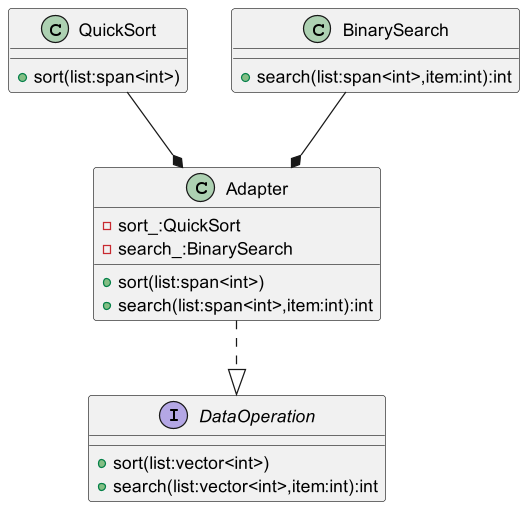
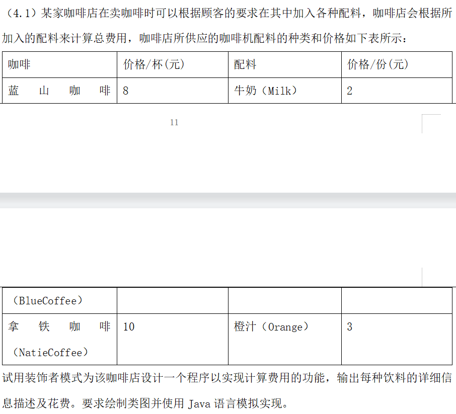

<!-- TOC -->
* [结构型模式](#结构型模式)
  * [1. 适配器模式](#1-适配器模式)
    * [题目](#题目)
    * [具体实现](#具体实现)
    * [总结](#总结)
  * [2. 桥接模式](#2-桥接模式)
    * [题目](#题目-1)
    * [具体实现](#具体实现-1)
    * [总结](#总结-1)
  * [3. 外观模式](#3-外观模式)
    * [题目一](#题目一)
      * [具体实现](#具体实现-2)
      * [总结](#总结-2)
    * [题目二](#题目二)
      * [具体实现](#具体实现-3)
      * [总结](#总结-3)
  * [4. 装饰者模式](#4-装饰者模式)
    * [题目一](#题目一-1)
      * [具体实现](#具体实现-4)
      * [总结](#总结-4)
    * [题目二](#题目二-1)
      * [具体实现](#具体实现-5)
      * [总结](#总结-5)
  * [5. 代理模式](#5-代理模式)
    * [题目](#题目-2)
    * [具体实现](#具体实现-6)
    * [总结](#总结-6)
<!-- TOC -->
# 结构型模式

## 1. 适配器模式

### 题目
现有一个接口 `DataOperation` 定义了排序方法 `sort(int[])` 和查找方法 `search(int[],int)` ，已知类 `QuickSort` 的 `quickSort(int[])` 方法实现了快速排序算法，类 `BinarySearch` 的 `binarySearch(int[],int)` 方法实现了二分查找算法。现使用适配器模式设计一个系统，在不修改源代码的情况下将类 `QuickSort` 和类 `BinarySearch` 的方法适配到 `DataOperation` 接口中。绘制类图并编程实现。
### 具体实现
* 类图:

* 类实现:
  * [adapter.h](adapter.h)
* 测试:
  * [adapter_test.cc](../../tests/adapter_test.cc)
### 总结
适配器模式通过一层间接接口来组合实现本来就有的功能,可随时插拔.

## 2. 桥接模式
### 题目
二、在HuntBird游戏中，需要模拟不同鸟的多种行为，鸟类中提供了对其各种行为信息进行显示的show()方法，目前游戏需要呈现的是鸽子和企鹅的飞和游泳行为，现使用桥接模式设计该游戏（设计需要考虑到后期鸟的种类和行为的变化性），要求绘制该应用的UML类图，并实现。（能力较好的同学可以综合运用工厂模式和桥接模式来完成，其中工厂模式用于创建各种鸟类）
### 具体实现
* 类图:
  
* 类实现:
    * [adapter.h](adapter.h)
* 测试:
    * [adapter_test.cc](../../tests/adapter_test.cc)
### 总结
适配器模式通过一层间接接口来组合实现本来就有的功能,可随时插拔.

## 3. 外观模式
### 题目一
（3.1）在电脑主机（MainFrame）中只需要按下主机的开机按钮（on（））,即可调用其它硬件设备和软件的启动方法，如内存（Memory）的自检（check()）、CPU的运行（run()）、硬盘（HardDisk）的读取（read()）、操作系统（OS）的载入（load())等，如果某一过程发生错误则电脑启动失败。使用外观模式模拟该过程，绘制类图并使用Java语言模拟实现。
#### 具体实现
* 类图:
  
* 类实现:
    * [adapter.h](adapter.h)
* 测试:
    * [adapter_test.cc](../../tests/adapter_test.cc)
#### 总结
适配器模式通过一层间接接口来组合实现本来就有的功能,可随时插拔.

### 题目二
（3.2）某系统需要提供一个文件加密模块，加密流程包括三个操作，分别是读取源文件、加密、保存加密之后的文件。读取文件和保存文件使用流来实现，这三个操作相对独立，其业务代码封装在三个不同的类中。现在需要提供一个统一的加密外观类，用户可以直接使用该加密外观类完成文件的读取、加密和保存三个操作，而不需要与每一个类交互，使用外观模式设计该加密模块，要求编程模拟实现。 
#### 具体实现
* 类图:
  
* 类实现:
    * [adapter.h](adapter.h)
* 测试:
    * [adapter_test.cc](../../tests/adapter_test.cc)
#### 总结
适配器模式通过一层间接接口来组合实现本来就有的功能,可随时插拔.

## 4. 装饰者模式
### 题目一

#### 具体实现
* 类图:
  
* 类实现:
    * [adapter.h](adapter.h)
* 测试:
    * [adapter_test.cc](../../tests/adapter_test.cc)
#### 总结
适配器模式通过一层间接接口来组合实现本来就有的功能,可随时插拔.

### 题目二
（4.2）装饰模式实例之界面显示构件库
某软件公司基于面向对象技术开发了一套图形界面显示构件库VisualComponent。在使用该库构建某图形界面时，用户要求为界面定制一些特效显示效果，如带滚动条的窗体或透明窗体等。现使用装饰模式设计该构件库，绘制类图并编程模拟实现。实现的具体效果与桥接模式有些相似。
#### 具体实现
* 类图:
  
* 类实现:
    * [adapter.h](adapter.h)
* 测试:
    * [adapter_test.cc](../../tests/adapter_test.cc)
#### 总结
适配器模式通过一层间接接口来组合实现本来就有的功能,可随时插拔.

## 5. 代理模式
### 题目
在某商品购物系统中，注册用户可对商品进行订购，商品的订购信息以订单的方式体现，假设只有用户才能对自己的订单进行修改，其他人都不能修改。试使用代理模式来设计并实现。
要求订单中需要包括订购的商品名称（productName），订购商品数量(productNum)，下单客户姓名（customerName）的信息。
要求先设计类图并使用面向对象语言进行实现。

### 具体实现

### 总结